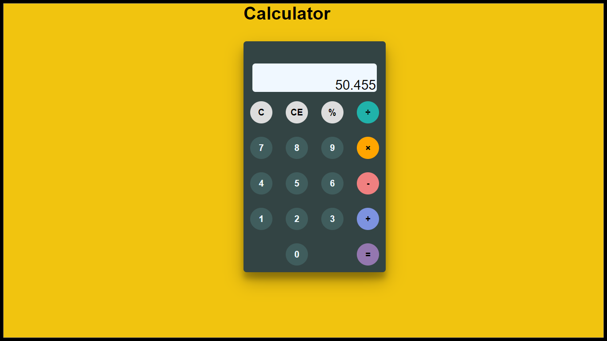

<h1>Calculator with Basic functionality</h1>

<h3>Various Operations : </h3>
 
<ul>
    <li style="font-size:20px;color:darkslategray">Addition</li>
    <li style="font-size:20px;color:darkslategray">Subtraction</li>
    <li style="font-size:20px;color:darkslategray">Multiplication</li>
    <li style="font-size:20px;color:darkslategray">Division</li>
    <li style="font-size:20px;color:darkslategray">Remainder</li>
</ul>